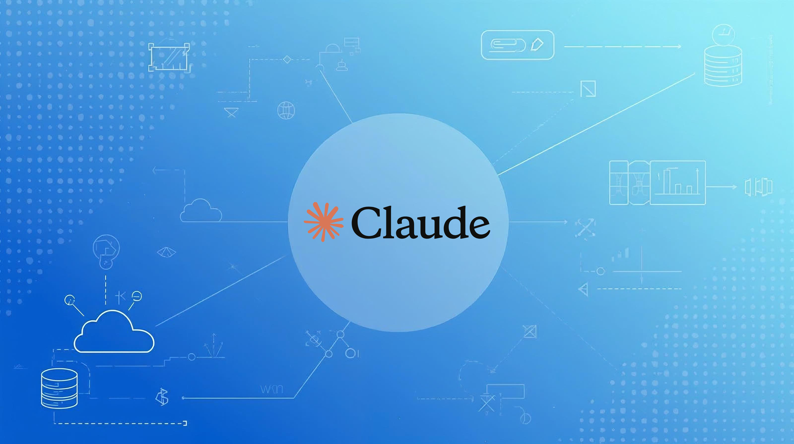

# [Claude Code in a nutshell - for programmers and beyond (EN)](https://www.udemy.com/course/claude-code-in-a-nutshell-for-programmers-and-beyond/?referralCode=9697CDDD6A3C3CB14B38)

> Version 2026

Hey,

the materials here are related to the course ["Claude Code in a nutshell - for programmers and beyond, available on Udemy (EN)"](https://www.udemy.com/course/claude-code-in-a-nutshell-for-programmers-and-beyond/?referralCode=9697CDDD6A3C3CB14B38).

Starter project: [claude-course-tanstack-starter](https://github.com/pnowy/claude-course-tanstack-starter)

Project with changes: [claude-course-home-budget](https://github.com/pnowy/claude-course-home-budget)

[Slides](./slides.pdf)

If you are interested in the course, visit the Udemy page or contact me at:

If you purchased the course or used the materials, I encourage you to click [⭐ Star] 😉

Also check out my other courses:

[Docker from scratch — for programmers and beyond (PL)](https://www.udemy.com/course/docker-od-podstaw-dla-programistow-i-nie-tylko/?referralCode=39F9BBE841432712F0F4)

[Kubernetes from scratch — for programmers and beyond (PL)](https://www.udemy.com/course/kubernetes-od-podstaw-dla-programistow-i-nie-tylko/?referralCode=4AB1DB66CD8879CF5F4B)

---

# [Claude Code w pigułce — dla programistów i nie tylko (PL)](https://www.udemy.com/course/claude-code-w-pigulce-dla-programistow-i-nie-tylko/?referralCode=61BDE20E46F94B0387A9)

> Wersja 2026

Hej,

materiały tutaj zawarte dotyczą kursu ["Claude Code w pigułce — dla programistów i nie tylko dostępnego na Udemy (PL)"](https://www.udemy.com/course/claude-code-w-pigulce-dla-programistow-i-nie-tylko/?referralCode=61BDE20E46F94B0387A9).

Projekt starter: [claude-course-tanstack-starter](https://github.com/pnowy/claude-course-tanstack-starter)

Projekt ze zmianami: [claude-course-home-budget](https://github.com/pnowy/claude-course-home-budget)

[Slajdy](./slajdy.pdf)

W razie zainteresowania kursem zapraszam na stronę Udemy lub kontakt pod adresem:

Jeżeli zakupiłeś kurs lub korzystałeś z materiałów zachęcam do kliknięcia na [⭐ Star] 😉

Zobacz też moje inne kursy:

[Docker od podstaw — dla programistów i nie tylko](https://www.udemy.com/course/docker-od-podstaw-dla-programistow-i-nie-tylko/?referralCode=39F9BBE841432712F0F4)

[Kubernetes od podstaw — dla programistów i nie tylko](https://www.udemy.com/course/kubernetes-od-podstaw-dla-programistow-i-nie-tylko/?referralCode=4AB1DB66CD8879CF5F4B)